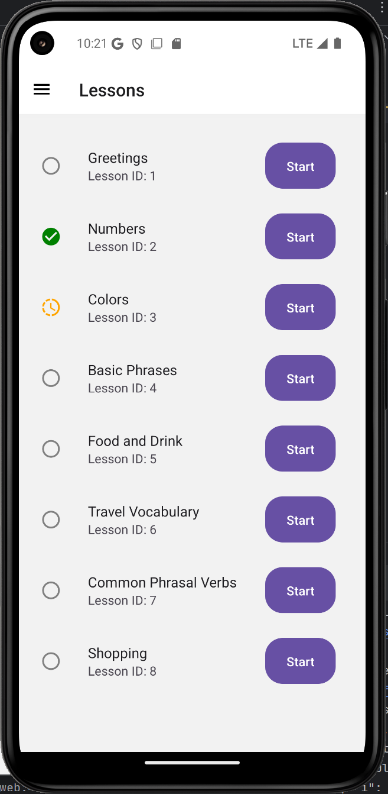
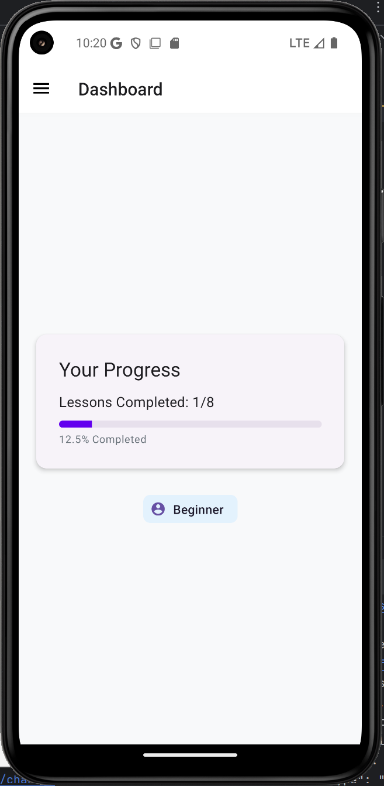
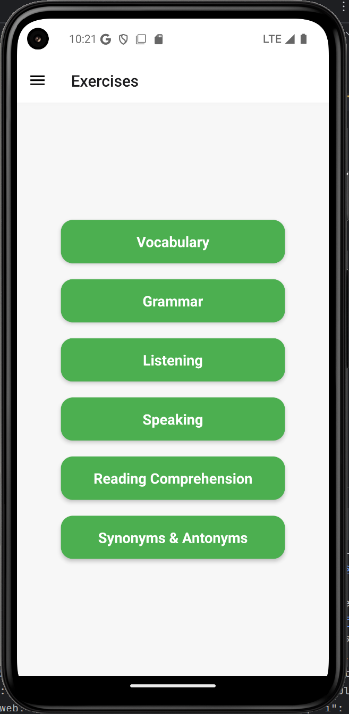
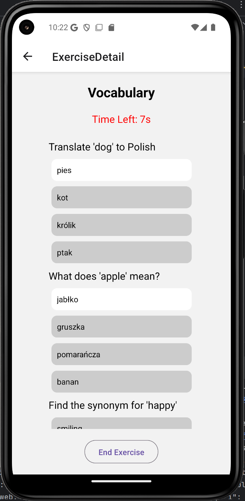
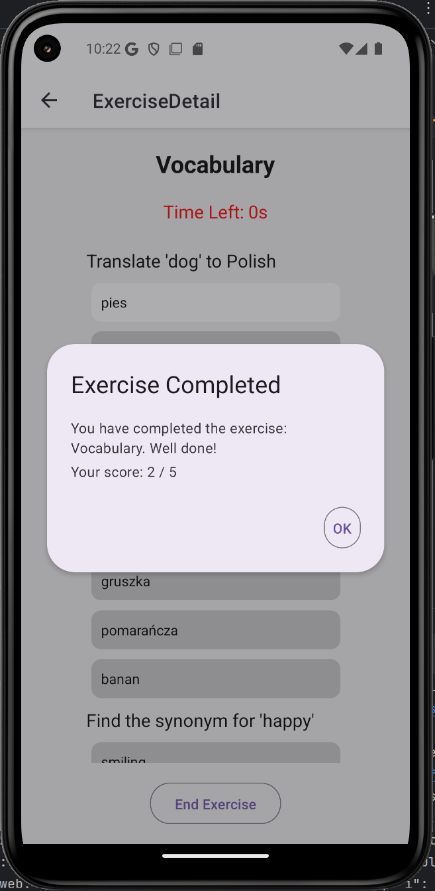

# Language Learning App

Aplikacja do nauki języków, która pomaga użytkownikom w szybkim przyswajaniu nowych słówek i zwrotów w języku angielskim. Dzięki interaktywnym lekcjom i ćwiczeniom, nauka staje się łatwiejsza i bardziej efektywna.

    
    
    
    
    

## Opis
Aplikacja jest zaprojektowana w celu ułatwienia nauki języków obcych poprzez zapewnienie użytkownikom spersonalizowanego doświadczenia. Użytkownicy mogą rejestrować się i logować, monitorować swoje postępy, wybierać lekcje na różnych poziomach trudności oraz ćwiczyć zdobytą wiedzę za pomocą interaktywnych ćwiczeń.

Po zalogowaniu użytkownik uzyskuje dostęp do następujących funkcji:

- Dashboard: Wyświetla postępy użytkownika w nauce.
- Lekcje: Lista lekcji z możliwością wyboru i przejścia do szczegółów lekcji.
- Ćwiczenia: Dostęp do różnych rodzajów ćwiczeń, takich jak testy z czasomierzem.
